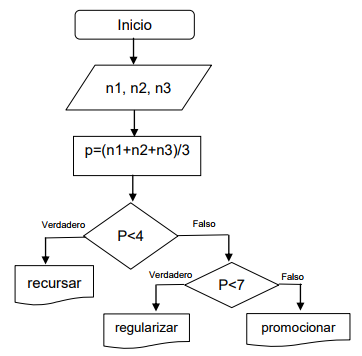

Analizar la realidad planteada en el diagrama de flujo para completar la plantilla del programa en C. Realizar el enunciado correspondiente.



```c
#include<stdio.h>

float promedio (_____,_____,____)
{
  return (________);
}
int main ()
{
  int n1, n2, n3;
  ______ p;
  printf (“ingrese nota del parcial 1”);
  scanf (_____);
  printf (“______________________”);
  scanf (_____);
  printf (“ingrese nota del parcial 3”);
  scanf (“%d”, &n3);
  p=promedio (___, n2, ___);
  if (____)
  printf (“_________”);
  else
  if (p>=7)
  printf (“__________”);
  else
  printf (“promocionar”);
  return 0;
}
```
